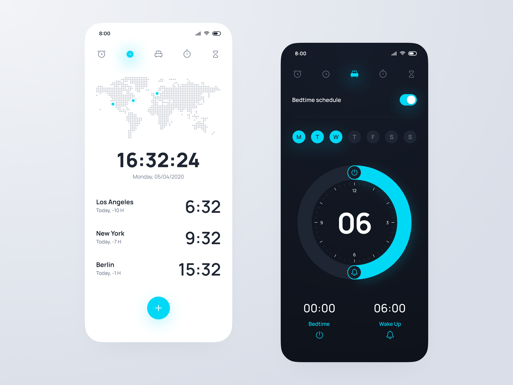
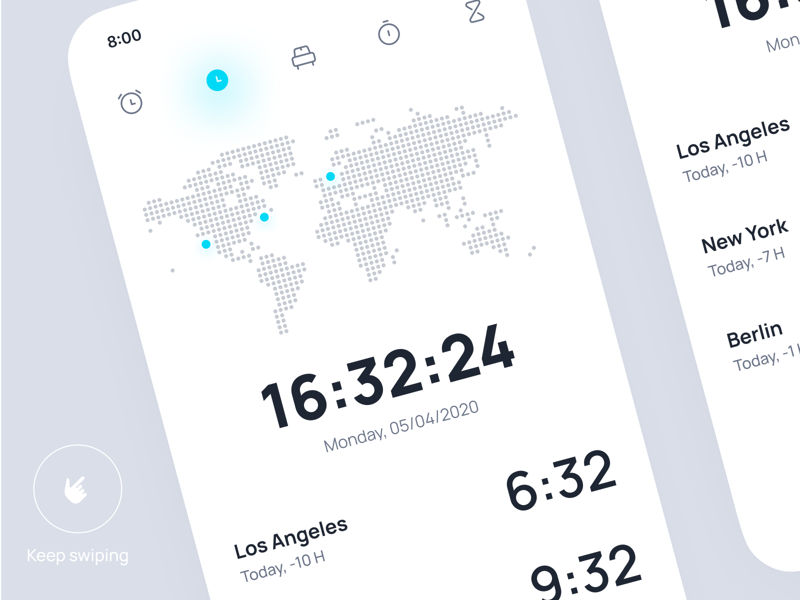

# Metronome
### A timekeeper application that includes a World Clock, Alarms, a Sleep Scheduler, a Stopwatch, an Animated Hourglass Timer, a Pomodoro Timer and a Todo/Task list.

**Status: In Development**  
**Developed On: Dart & Flutter**   
**Platform: iOS & Android**  

## What's Done?
- Home Page UI
- Navigation Bar
- World Map UI
- World Map City Highlighting
- Digital Clock UI and Functionality
- Clock Page UI

## Note
The UI for the application was inspired by a Dribble post available [here](https://dribbble.com/shots/14553716-Mobile-Clock-App/attachments/6242470?mode=media)  
All functional implementation was implemented independently.

## UI Reference

